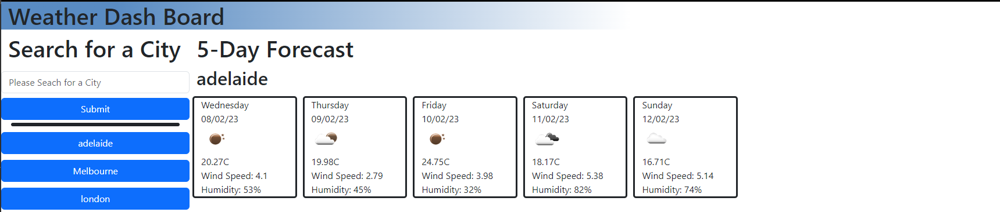

# WhatsTheWeather
## Description

This is an short activity is to put in to practice calling API, has come out in the form of a weather website that get the weather data from https://openweathermap.org/

link to pages - https://miaodl4.github.io/WhatsTheWeather/

## Table of Contents 

- [Installation](#installation)
- [Usage](#usage)
- [Credits](#credits)
- [License](#license)

## Installation

N/A

## Usage

you are able to seach as city get the weather for the next 5 days
additional you are able to selection a previously searched city and have the weather forecast for that city

## Credits
N/a

## License

N/A
